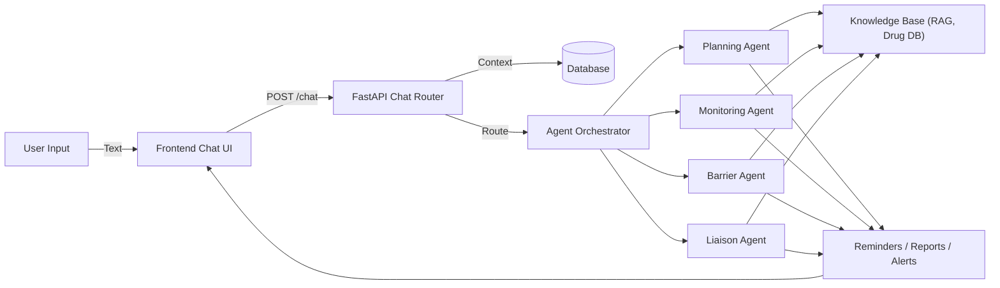
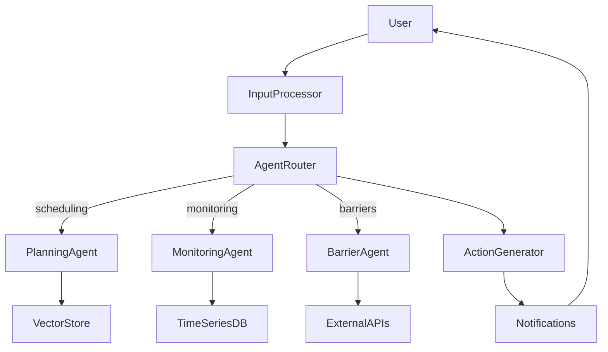

# AdherenceGuardian

AdherenceGuardian is a medication-adherence assistant combining a FastAPI backend, a React + Vite frontend, and LLM-driven agents for scheduling, monitoring, liaison, and barriers. The system helps patients track medication schedules, log doses, report symptoms, and get intelligent scheduling suggestions while ensuring safety rules and auditability.

**Quick links**
- API: [api/chat.py](api/chat.py)
- Frontend Chat UI: frontend/src/components/Chat.tsx
- LLM service: services/llm_service.py
- Planning agent prompts: agents/prompts/planning_prompts.py

---

**Contents**
- System functionality and assumptions
# AdherenceGuardian
An agentic AI assistant to improve medication adherence by planning, monitoring, and intervening—combining a FastAPI backend, React + Vite frontend, and LLM-driven agents.

## Table of Contents

1. Problem Statement
2. Solution Overview
3. Why Agentic AI?
4. System Architecture
5. Agent Roles
6. Quick Start
7. Usage Examples
8. Datasets
9. Technical Implementation
10. Limitations & Future Work
11. Contributing
12. License & Contact

---

## Problem Statement

Medication non-adherence causes preventable morbidity, mortality, and costs. AdherenceGuardian addresses complexity, side effects, cost barriers, and forgetfulness through planning, monitoring, and patient-centric interventions.

## Solution Overview

- Intelligent scheduling that respects drug constraints and user routines
- Adaptive monitoring and trend detection
- Barrier identification and automated interventions
- Structured provider communication and audit-friendly logs

## Why Agentic AI?

Agentic systems can plan, act, and adapt. AdherenceGuardian demonstrates goal-directed planning, multi-step reasoning, and safe escalation rules for clinical contexts.

## System Architecture

High-level components:

- Frontend: React + Vite chat UI, quick actions, charts
- Backend: FastAPI with services (LLM, schedule, adherence)
- Agents: Planning, Monitoring, Barrier, Liaison
- Knowledge Base: Drug DB, guidelines, vector store (RAG)
- Database: SQLAlchemy (SQLite for dev / Postgres for production)

### Architecture diagram (component flow)



### Architecture diagram (detailed workflow)



## Quick Start

Prerequisites: Python 3.10+, Node 18+, Git

Clone and install:

```bash
git clone https://github.com/your-team/adherence-guardian.git
cd adherence-guardian
python -m venv .venv
.venv\Scripts\activate    # Windows
pip install -r requirements.txt
cd frontend
npm install
```

Initialize DB and seed sample data (dev):

```bash
cd ..
python -m database init_db
python scripts/add_fake_patients.py
python scripts/add_sample_medications.py
python scripts/generate_60day_history.py
```

Run backend + frontend:

```bash
# Backend (repo root)
uvicorn app:app --reload

# Frontend (separate terminal)
cd frontend
npm run dev
```

Open the UI at the address shown by Vite (usually http://localhost:5173).

## Usage Examples

- Quick actions: "What's my next dose?", "Log dose", "Report symptom"
- Provider reports: generate 7/30-day adherence summaries via the Liaison Agent
- Scripts: see `scripts/` for seeding and data generation helpers

## Datasets

- RxNorm — canonical medication names (NLM)
- DrugBank — interaction metadata (when licensed)
- SIDER — side effect mappings
- Synthetic data in `data/synthetic/` for testing

## Technical Implementation (summary)

- Backend: FastAPI, SQLAlchemy models in `models.py`, services (`services/`)
- Frontend: React + TypeScript, `frontend/src/components/Chat.tsx` for chat UI
- Agents: modular agents in `agents/` with prompt templates in `agents/prompts/`
- LLM: wrapped in `services/llm_service.py` with time-context injection and structured output enforcement
- RAG: `knowledge_base/vector_store.py` using Chroma/SQLite for local dev

## Limitations & Safety

- Not a medical device — for support and prototyping only
- LLM outputs must be validated before clinical actions
- Timezone correctness is required for accurate scheduling
- Do not store PHI in this repo; follow HIPAA rules for production

